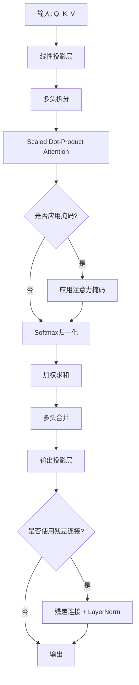
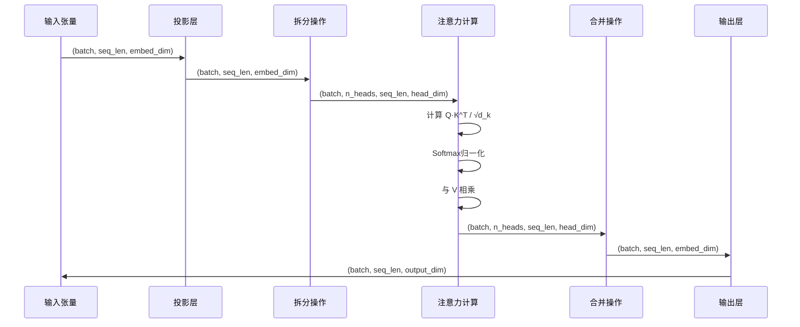
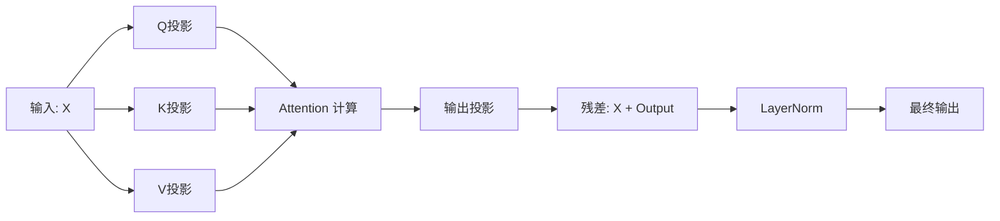
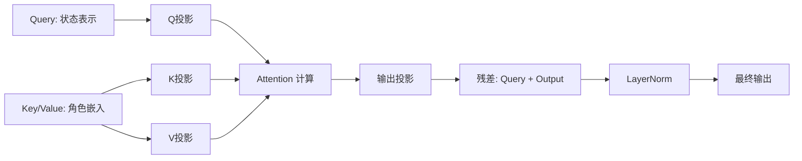

# Attention Layer 设计文档

## 1. 设计目标

设计一个通用的、增强版的注意力层（Attention Layer）模块，作为项目中现有 MultiHeadAttention 的补充和扩展。新模块需要：

- 支持多种注意力计算模式（自注意力、交叉注意力）
- 提供掩码机制以支持序列填充和因果注意力
- 集成残差连接和层归一化以增强训练稳定性
- 保持与现有 ACORM_QMIX 和 ACORM_MAPPO 框架的兼容性
- 提供灵活的配置选项以适应不同应用场景

## 2. 架构设计

### 2.1 模块结构

Attention Layer 由以下核心组件构成：

### 2.2 组件职责划分

| 组件名称 | 职责描述 | 输入 | 输出 |
|---------|---------|------|------|
| 线性投影层 | 将输入的 Q、K、V 映射到注意力空间 | 原始特征向量 | 投影后的 Q、K、V 张量 |
| 多头拆分 | 将注意力维度拆分为多个独立的注意力头 | 投影后的张量 | 重塑后的多头张量 |
| Scaled Dot-Product | 计算注意力分数（Q·K^T / √d_k） | Q、K 张量 | 注意力得分矩阵 |
| 掩码应用器 | 对特定位置施加负无穷掩码 | 注意力得分 + 掩码 | 掩码后的得分 |
| 加权求和 | 使用注意力权重对 V 进行加权 | 注意力权重 + V | 聚合后的特征 |
| 输出投影层 | 将多头结果映射到目标维度 | 合并后的多头特征 | 最终输出特征 |
| 残差连接模块 | 缓解梯度消失，促进信息流动 | 注意力输出 + 原始输入 | 归一化后的输出 |

## 3. 功能特性

### 3.1 核心特性

#### 3.1.1 多头注意力机制

**设计原理**：将注意力计算分解为多个并行的子空间，使模型能够同时关注不同表示子空间的信息。

**参数配置**：

| 参数名 | 类型 | 说明 | 默认值 |
|-------|------|------|--------|
| n_heads | 整数 | 注意力头的数量 | 8 |
| embed_dim | 整数 | 嵌入维度（必须能被 n_heads 整除） | 256 |
| head_dim | 整数 | 每个头的维度（自动计算：embed_dim / n_heads） | 自动 |

**计算流程**：

#### 3.1.2 注意力掩码机制

**支持的掩码类型**：

| 掩码类型 | 应用场景 | 掩码形状 | 说明 |
|---------|---------|---------|------|
| 填充掩码 | 处理变长序列的填充部分 | (batch, seq_len) | 标记填充位置为 True/1 |
| 因果掩码 | 自回归模型中防止未来信息泄露 | (seq_len, seq_len) | 上三角矩阵 |
| 自定义掩码 | 用户定义的任意掩码模式 | (batch, n_heads, seq_len, seq_len) | 灵活的注意力控制 |

**掩码应用逻辑**：

在计算 Softmax 之前，将掩码位置的注意力分数设置为负无穷大（-1e10 或 -inf），确保这些位置在归一化后的权重接近于零。

#### 3.1.3 温度缩放

**设计目的**：控制注意力分布的平滑度，防止梯度消失或过度集中。

**缩放公式**：

温度系数 = √(head_dim) / soft_temperature_factor

注意力得分 = (Q · K^T) / 温度系数

**参数说明**：

| 参数名 | 类型 | 说明 | 推荐范围 |
|-------|------|------|---------|
| soft_temperature | 浮点数 | 温度调节因子，值越大分布越平滑 | 0.5 ~ 2.0 |

### 3.2 增强特性

#### 3.2.1 残差连接

**应用条件**：当输入维度与输出维度一致时，自动启用残差连接。

**计算公式**：

output = LayerNorm(input + Attention(input))

**优势**：

- 缓解深层网络的梯度消失问题
- 保留原始输入信息，促进特征融合
- 加速模型收敛

#### 3.2.2 层归一化（Layer Normalization）

**应用位置**：残差连接之后（Post-LN 架构）

**归一化维度**：特征维度（最后一个维度）

**可配置选项**：

| 参数名 | 类型 | 说明 | 默认值 |
|-------|------|------|--------|
| use_layer_norm | 布尔值 | 是否启用层归一化 | True |
| layer_norm_eps | 浮点数 | 归一化时的数值稳定性参数 | 1e-6 |

#### 3.2.3 Dropout 正则化

**应用位置**：

1. 注意力权重 Dropout：在 Softmax 之后，对注意力权重应用 Dropout
2. 输出 Dropout：在最终输出投影之后应用 Dropout

**参数配置**：

| 参数名 | 类型 | 说明 | 推荐值 |
|-------|------|------|--------|
| attention_dropout | 浮点数 | 注意力权重的 Dropout 率 | 0.1 |
| output_dropout | 浮点数 | 输出层的 Dropout 率 | 0.1 |

## 4. 接口设计

### 4.1 模块初始化参数

| 参数名 | 类型 | 必需 | 说明 | 默认值 |
|-------|------|------|------|--------|
| embed_dim | 整数 | 是 | 输入和输出的特征维度 | - |
| n_heads | 整数 | 是 | 注意力头的数量 | - |
| output_dim | 整数 | 否 | 输出特征维度，默认与 embed_dim 相同 | embed_dim |
| qkv_bias | 布尔值 | 否 | Q、K、V 投影层是否使用偏置 | False |
| output_bias | 布尔值 | 否 | 输出投影层是否使用偏置 | True |
| soft_temperature | 浮点数 | 否 | 温度缩放因子 | 1.0 |
| attention_dropout | 浮点数 | 否 | 注意力权重 Dropout 率 | 0.0 |
| output_dropout | 浮点数 | 否 | 输出层 Dropout 率 | 0.0 |
| use_residual | 布尔值 | 否 | 是否使用残差连接（需 embed_dim == output_dim） | True |
| use_layer_norm | 布尔值 | 否 | 是否使用层归一化 | True |

### 4.2 前向传播接口

**函数签名**：

forward(query, key, value, attention_mask, return_attention_weights)

**参数说明**：

| 参数名 | 类型 | 形状 | 必需 | 说明 |
|-------|------|------|------|------|
| query | 张量 | (batch, seq_len_q, embed_dim) | 是 | 查询向量 |
| key | 张量 | (batch, seq_len_k, embed_dim) | 否 | 键向量，默认与 query 相同 |
| value | 张量 | (batch, seq_len_k, embed_dim) | 否 | 值向量，默认与 key 相同 |
| attention_mask | 张量 | (batch, seq_len_q, seq_len_k) 或其广播兼容形状 | 否 | 注意力掩码，True/1 表示掩蔽位置 |
| return_attention_weights | 布尔值 | - | 否 | 是否返回注意力权重（用于可视化） |

**返回值**：

| 情况 | 返回类型 | 说明 |
|------|---------|------|
| return_attention_weights=False | 张量 | 形状 (batch, seq_len_q, output_dim) |
| return_attention_weights=True | 元组 | (输出张量, 注意力权重张量) |

**注意力权重张量形状**：(batch, n_heads, seq_len_q, seq_len_k)

## 5. 数据流设计

### 5.1 自注意力模式（Self-Attention）

**应用场景**：智能体嵌入的自增强、角色表示的内部关联建模

**数据流图**：

**调用示例**：

输入：agent_embeddings，形状 (batch, N, agent_embed_dim)

调用：attention_layer(query=agent_embeddings)

输出：enhanced_embeddings，形状 (batch, N, output_dim)

### 5.2 交叉注意力模式（Cross-Attention）

**应用场景**：智能体观察与角色表示的融合、Critic 网络中状态表示与角色嵌入的交互

**数据流图**：

**调用示例**：

输入：
- query: state_representations，形状 (batch, N, state_dim)
- key/value: role_embeddings，形状 (batch, N, role_dim)

调用：attention_layer(query=state_representations, key=role_embeddings, value=role_embeddings)

输出：attended_features，形状 (batch, N, output_dim)

## 6. 与现有架构的集成

### 6.1 ACORM_QMIX 框架集成

**集成位置**：在 util/attention.py 中新增 EnhancedAttentionLayer 类

**使用场景**：

| 模块 | 应用点 | 输入 | 预期效果 |
|------|--------|------|----------|
| Agent_Embedding | 智能体特征增强 | 观察嵌入 | 捕获智能体间的交互关系 |
| Role_Embedding | 角色表示精炼 | 智能体嵌入 | 强化角色特征的区分性 |
| Q_network | 动作价值估计 | 状态-角色联合表示 | 提升价值函数的表达能力 |

**与现有 MultiHeadAttention 的关系**：

- 保留现有 MultiHeadAttention 的简洁实现，用于基础场景
- EnhancedAttentionLayer 提供高级功能（掩码、残差连接等），用于复杂场景
- 两者可根据实验需求灵活切换

### 6.2 ACORM_MAPPO 框架集成

**集成位置**：在 util/attention.py 中新增 EnhancedAttentionLayer 类

**使用场景**：

| 模块 | 应用点 | 输入 | 预期效果 |
|------|--------|------|----------|
| ACORM_Critic | 价值网络的注意力计算 | 状态表示（Q）与角色嵌入（K、V） | 替换现有 MultiHeadAttention，增强稳定性 |
| 潜在扩展 | Actor 网络的动作选择 | 智能体嵌入与全局上下文 | 提升策略网络的协作感知能力 |

**替换现有实现的步骤**：

1. 在 ACORM_Critic 初始化时实例化 EnhancedAttentionLayer
2. 保持接口兼容：确保输入输出维度与原 MultiHeadAttention 一致
3. 启用残差连接和层归一化以提升训练稳定性
4. 可选：添加 Dropout 以增强泛化能力

## 7. 配置参数推荐

### 7.1 QMIX 框架推荐配置

**基础配置**（保守稳定）：

| 参数 | 推荐值 | 说明 |
|------|--------|------|
| n_heads | 4 | 智能体数量通常较少，头数适中 |
| embed_dim | 128 | 与 agent_embedding_dim 保持一致 |
| soft_temperature | 1.0 | 标准缩放 |
| attention_dropout | 0.0 | 初期不使用 Dropout |
| use_residual | True | 启用残差连接 |
| use_layer_norm | True | 启用层归一化 |

**高级配置**（追求性能）：

| 参数 | 推荐值 | 说明 |
|------|--------|------|
| n_heads | 8 | 增加表示多样性 |
| attention_dropout | 0.1 | 防止过拟合 |
| soft_temperature | 0.8 | 更锐利的注意力分布 |

### 7.2 MAPPO 框架推荐配置

**Critic 网络配置**：

| 参数 | 推荐值 | 说明 |
|------|--------|------|
| n_heads | 对齐现有 args.n_heads | 保持与原架构一致 |
| embed_dim | args.att_dim | 与原注意力维度一致 |
| output_dim | args.att_out_dim | 输出维度保持不变 |
| soft_temperature | args.soft_temp | 使用原有温度参数 |
| attention_dropout | 0.1 | 新增正则化 |
| use_residual | True | 增强稳定性 |

## 8. 性能优化考虑

### 8.1 计算效率优化

**策略**：

| 优化点 | 实现方式 | 预期收益 |
|--------|---------|----------|
| 批量矩阵乘法 | 使用 torch.bmm 或 torch.matmul | 充分利用 GPU 并行计算能力 |
| 内存布局优化 | 连续内存的张量重塑操作 | 减少内存访问延迟 |
| 混合精度训练 | 支持 torch.cuda.amp | 加速训练并降低显存占用 |
| 掩码稀疏化 | 对全零掩码跳过掩码操作 | 减少不必要的计算 |

### 8.2 数值稳定性保障

**措施**：

| 风险点 | 解决方案 |
|--------|----------|
| Softmax 溢出 | 使用 PyTorch 内置的稳定版 Softmax |
| 除零错误 | LayerNorm 添加 epsilon（1e-6） |
| 梯度爆炸 | 梯度裁剪（在训练循环中配置） |
| 极端注意力分数 | 掩码值使用 -1e10 而非 -inf |

## 9. 验证与测试策略

### 9.1 单元测试覆盖

**测试维度**：

| 测试项 | 验证内容 | 通过标准 |
|--------|---------|----------|
| 形状一致性 | 各种输入形状下的输出形状正确性 | 输出形状符合预期 |
| 掩码有效性 | 掩码位置的注意力权重接近零 | 权重 < 1e-5 |
| 梯度流动性 | 反向传播梯度非空且有界 | 梯度范数在合理范围 |
| 残差连接 | 有无残差连接的输出差异 | 启用残差时训练更稳定 |
| 数值稳定性 | 极端输入下不产生 NaN/Inf | 所有输出为有效数值 |

### 9.2 集成测试方案

**测试场景**：

| 场景 | 测试内容 | 预期结果 |
|------|---------|----------|
| 替换现有 MultiHeadAttention | 在 ACORM_Critic 中无缝替换 | 训练正常运行，性能不下降 |
| 多智能体环境测试 | 在 SMAC 的 MMM2 地图上训练 | 收敛速度与原实现相当或更优 |
| 变长序列处理 | 使用填充掩码处理不同长度的轨迹 | 掩码位置不影响有效位置的梯度 |

### 9.3 性能基准测试

**基准指标**：

| 指标 | 测试方法 | 目标 |
|------|---------|------|
| 前向传播延迟 | 固定输入下测量 100 次前向的平均时间 | < 现有实现的 120% |
| 显存占用 | 记录训练时的峰值显存 | < 现有实现的 150% |
| 训练稳定性 | 观察损失曲线的波动性 | 使用残差+LN后波动减小 |

## 10. 扩展性设计

### 10.1 可扩展点

| 扩展方向 | 预留接口 | 应用场景 |
|---------|---------|----------|
| 相对位置编码 | 初始化参数中预留 use_relative_position | 处理序列顺序信息 |
| 可学习温度 | 将 soft_temperature 改为 nn.Parameter | 自适应调节注意力锐度 |
| 稀疏注意力 | 支持自定义注意力模式的掩码生成器 | 超长序列的高效处理 |
| 多尺度注意力 | 支持不同头使用不同的 head_dim | 捕获多粒度特征 |

### 10.2 未来优化方向

| 方向 | 技术路线 | 预期收益 |
|------|---------|----------|
| Flash Attention 集成 | 使用 xformers 或 flash-attn 库 | 大幅降低显存和计算时间 |
| 动态头数调整 | 根据任务复杂度自动选择头数 | 提升模型效率 |
| 注意力可视化工具 | 集成热力图绘制功能 | 辅助调试和可解释性分析 |

## 11. 风险与限制

### 11.1 已知限制

| 限制项 | 说明 | 应对措施 |
|--------|------|----------|
| 计算复杂度 | 注意力计算的时间复杂度为 O(N²d)，序列过长时开销大 | 仅在必要时使用，或采用稀疏注意力 |
| 参数量增加 | 相比简单网络增加 4 倍参数（Q、K、V、Output 投影） | 在小规模任务上可能过参数化 |
| 超参敏感性 | 头数、温度等参数对性能影响大 | 提供经过验证的推荐配置 |

### 11.2 潜在风险

| 风险 | 触发条件 | 缓解方案 |
|------|---------|----------|
| 训练不稳定 | 学习率过大或初始化不当 | 启用层归一化，降低学习率 |
| 过拟合 | 小数据集 + 高容量模型 | 增加 Dropout 率，使用数据增强 |
| 注意力坍塌 | 所有位置的注意力权重趋于均匀 | 调整温度参数，检查输入特征的区分度 |

## 12. 实施优先级

### 12.1 核心功能（P0 - 必须实现）

- 多头注意力基础计算逻辑
- 温度缩放机制
- 注意力掩码支持
- 残差连接与层归一化

### 12.2 重要功能（P1 - 高优先级）

- Dropout 正则化
- 与 ACORM_Critic 的集成适配
- 单元测试覆盖

### 12.3 增强功能（P2 - 中优先级）

- 注意力权重返回（可视化支持）
- 性能优化（批量计算、内存优化）
- 扩展配置选项

### 12.4 扩展功能（P3 - 低优先级）

- 相对位置编码
- Flash Attention 集成
- 可视化工具

## 13. 成功标准

**模块视为成功实现需满足以下条件**：

| 指标 | 成功标准 |
|------|----------|
| 功能完整性 | 所有 P0 和 P1 功能正常工作 |
| 兼容性 | 可无缝替换 ACORM_Critic 中的现有 MultiHeadAttention |
| 性能 | 在 SMAC MMM2 任务上训练，收敛速度不低于基线的 95% |
| 稳定性 | 训练过程中无 NaN/Inf，损失曲线平滑度提升 |
| 代码质量 | 单元测试覆盖率 > 80%，通过所有测试用例 |
| 文档完备性 | 提供清晰的使用示例和参数说明 |
